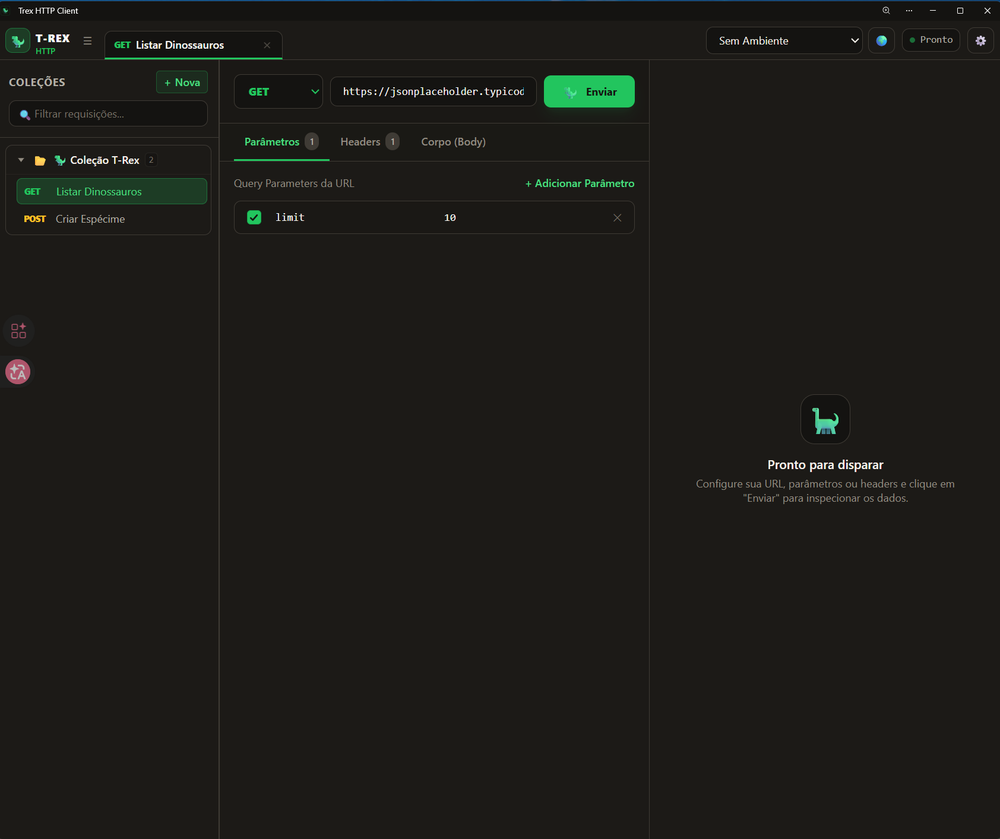
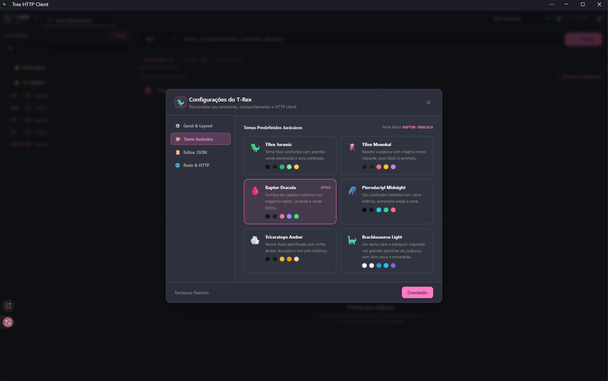
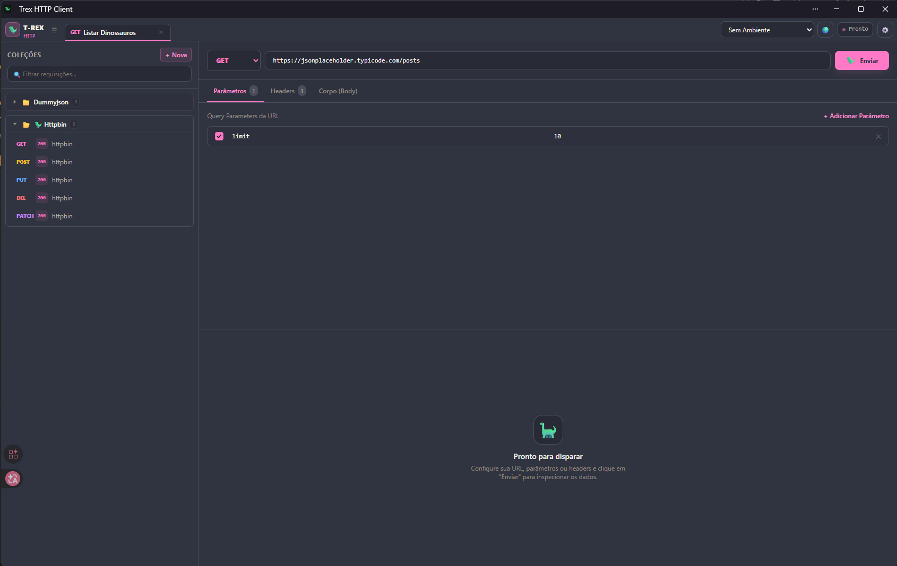
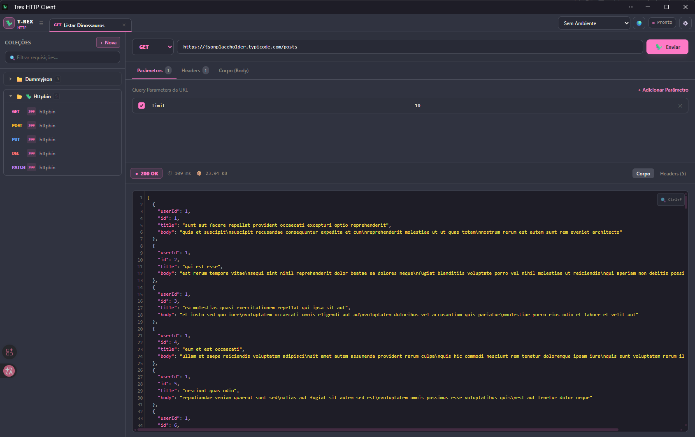

<h1> Trex HTTP Client</h1>

Bem-vindo ao **Trex**, o seu cliente HTTP com temática jurássica! 

O Trex foi criado para ser uma alternativa rápida, leve e direto no navegador para testar suas APIs (como o Postman ou Insomnia), com a vantagem de funcionar de forma offline-first e não exigir instalação de arquivos pesados.

---

## 🚀 Como Acessar

Você não precisa baixar nenhum arquivo executável para usar o Trex. Ele roda direto do seu navegador!

👉 **[Clique aqui para abrir o Trex HTTP Client](https://eusouanderson.github.io/Trex-Http-Client/)**

---

## 📱 Como Instalar (Aplicativo PWA)

O Trex é um aplicativo web progressivo (PWA). Isso significa que você pode "instalá-lo" no seu computador ou celular para usar como um aplicativo nativo (com atalho na área de trabalho, tela cheia, etc).

### No Computador (Chrome / Edge)
1. Abra o [link do Trex](https://eusouanderson.github.io/Trex-Http-Client/) no seu navegador.
2. Olhe para o lado direito da **barra de endereços** (onde fica a URL).
3. Clique no ícone de um computador com uma setinha para baixo (ou no botão escrito "Instalar").
4. Confirme a instalação. Pronto! O Trex agora tem um atalho no seu PC.

### No Celular (Android)
1. Abra o [link do Trex](https://eusouanderson.github.io/Trex-Http-Client/) no Google Chrome.
2. Toque no menu de três pontinhos no canto superior direito.
3. Selecione a opção **"Instalar aplicativo"** ou **"Adicionar à tela inicial"**.

### No iPhone (iOS)
1. Abra o [link do Trex](https://eusouanderson.github.io/Trex-Http-Client/) no Safari.
2. Toque no ícone de **Compartilhar** (um quadrado com uma seta para cima, na parte inferior da tela).
3. Role as opções para baixo e toque em **"Adicionar à Tela de Início"**.

---

## 📸 Conheça o Trex

Aqui estão algumas telas do aplicativo em funcionamento:

### Interface Principal
*(Teste de rotas, envio de requisições e análise de respostas com coloração de sintaxe)*

### Gerenciamento de Coleções
*(Salve suas requisições em coleções para não perder seu progresso)*

### Variáveis de Ambiente
*(Crie ambientes como Dev, QA e Produção para alternar facilmente as URLs das suas APIs)*

### Temas e Configurações
*(Personalize o tema do seu editor JSON para ficar com a sua cara)*

---

## 🛠️ Principais Recursos
* **Variáveis de Ambiente:** Configure `{{url}}` para alternar entre homologação e produção com um clique.
* **Coleções:** Salve e organize suas requisições HTTP favoritas.
* **Editor de Código:** Respostas JSON formatadas e coloridas, com suporte a diferentes temas de cor.
* **Offline-First:** Seus dados (coleções e ambientes) são salvos de forma segura no seu próprio navegador.

---
*Feito para tornar os testes de API mais simples e divertidos.* 
